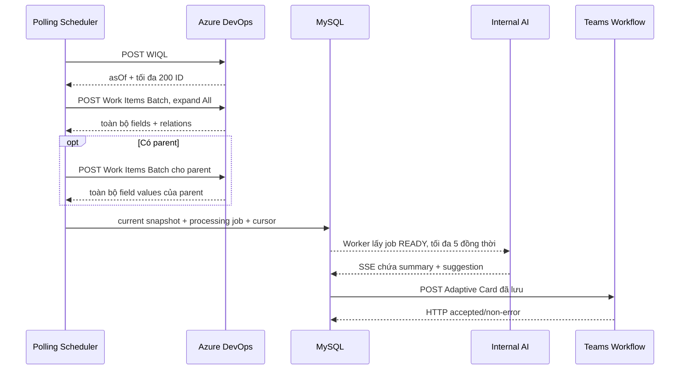

# Các API được sử dụng

Tài liệu này mô tả request/response mà phiên bản source hiện tại thực sự sử dụng. Không ghi token, PAT hoặc signed webhook URL thật vào Git, log hay tài liệu.

## 1. Tổng quan giao tiếp



## 2. Azure DevOps

### 2.1 Xác thực và version

Ứng dụng dùng HTTP Basic Authentication:

- username rỗng;
- password là `AZURE_DEVOPS_PAT`;
- `x-tfs-fedauthredirect: Suppress`;
- `x-vss-reauthenticationaction: Suppress`.

API version mặc định là `6.0`. Server hiện chỉ hỗ trợ tối đa `6.1`, vì vậy không đặt `7.0`.

Các ví dụ dưới đây dùng biến Bash:

```bash
export AZURE_BASE_URL='https://your-tfs-host.example/ads'
export AZURE_COLLECTION='your-collection'
export AZURE_PROJECT='your-project'
export AZURE_PAT='replace-with-pat'
export AZURE_API_VERSION='6.0'
```

### 2.2 WIQL lấy danh sách ID

Request:

```http
POST /{collection}/{project}/_apis/wit/wiql
    ?timePrecision=true
    &$top={pageSize}
    &api-version={version}
Content-Type: application/json
Authorization: Basic base64(":{PAT}")
```

Body ở lần đầu:

```json
{
  "query": "SELECT [System.Id] FROM WorkItems WHERE [System.TeamProject] = @project AND [System.State] = 'アクティブ' AND [System.WorkItemType] IN ('バグ', 'エラー') ORDER BY [System.ChangedDate] ASC, [System.Id] ASC"
}
```

Từ page thứ hai trở đi, ứng dụng thêm:

```text
AND (
  [System.ChangedDate] > '{cursorChangedDate}'
  OR (
    [System.ChangedDate] = '{cursorChangedDate}'
    AND [System.Id] > {cursorWorkItemId}
  )
)
```

Curl có thể import vào Postman:

```bash
curl --request POST \
  --url "${AZURE_BASE_URL}/${AZURE_COLLECTION}/${AZURE_PROJECT}/_apis/wit/wiql?timePrecision=true&%24top=200&api-version=${AZURE_API_VERSION}" \
  --user ":${AZURE_PAT}" \
  --header 'Content-Type: application/json' \
  --header 'Accept: application/json' \
  --header 'x-tfs-fedauthredirect: Suppress' \
  --header 'x-vss-reauthenticationaction: Suppress' \
  --data '{
    "query": "SELECT [System.Id] FROM WorkItems WHERE [System.TeamProject] = @project AND [System.State] = '\''アクティブ'\'' AND [System.WorkItemType] IN ('\''バグ'\'', '\''エラー'\'') ORDER BY [System.ChangedDate] ASC, [System.Id] ASC"
  }'
```

Ứng dụng cần hai thành phần trong response:

```json
{
  "asOf": "2026-07-27T01:00:00.000Z",
  "workItems": [
    { "id": 3735, "url": "..." }
  ]
}
```

`asOf` được chuyển sang Batch để các detail trong page cùng được đọc tại một snapshot thời gian.

### 2.3 Work Items Batch cho child

Request:

```http
POST /{collection}/{project}/_apis/wit/workitemsbatch?api-version={version}
```

Body:

```json
{
  "ids": [3735, 3736],
  "$expand": "All",
  "errorPolicy": "Fail",
  "asOf": "2026-07-27T01:00:00Z"
}
```

Không có thuộc tính `fields`, nghĩa là server trả toàn bộ fields. `errorPolicy=Fail` buộc page lỗi nếu một child không lấy được. Ứng dụng còn kiểm tra tập ID response phải bằng chính xác tập ID từ WIQL.

Curl:

```bash
curl --request POST \
  --url "${AZURE_BASE_URL}/${AZURE_COLLECTION}/${AZURE_PROJECT}/_apis/wit/workitemsbatch?api-version=${AZURE_API_VERSION}" \
  --user ":${AZURE_PAT}" \
  --header 'Content-Type: application/json' \
  --header 'Accept: application/json' \
  --header 'x-tfs-fedauthredirect: Suppress' \
  --header 'x-vss-reauthenticationaction: Suppress' \
  --data '{
    "ids": [3735],
    "$expand": "All",
    "errorPolicy": "Fail"
  }'
```

Các field bắt buộc:

| Field | Mục đích |
|---|---|
| `System.Id` hoặc root `id` | ID |
| `System.Rev` hoặc root `rev` | Revision |
| `System.WorkItemType` | Chọn description field |
| `System.State` | Xác nhận active |
| `System.Title` | Hiển thị và gửi AI |
| `System.TeamProject` | Khóa dữ liệu |
| `System.CreatedDate` | Hiển thị trên Teams |
| `System.ChangedDate` | Cursor |

Description:

| Type | Field mặc định |
|---|---|
| `バグ` | `Nttdata.TERASOLUNA.Common.Description` |
| `エラー` | `Nttdata.TERASOLUNA.Error.Issue` |

Tên field có thể override bằng `AZURE_DEVOPS_BUG_DESCRIPTION_FIELD` và `AZURE_DEVOPS_ERROR_DESCRIPTION_FIELD`.

Tất cả scalar values trong `fields` còn được dùng làm bằng chứng để tìm `電算`, leader, repository và module.

### 2.4 Batch cho parent

Ứng dụng lấy parent ID từ relation:

```json
{
  "rel": "System.LinkTypes.Hierarchy-Reverse",
  "url": "https://host/.../_apis/wit/workItems/2583"
}
```

Parent cũng được gọi qua Work Items Batch với:

```json
{
  "ids": [2583],
  "$expand": "All",
  "errorPolicy": "Omit",
  "asOf": "2026-07-27T01:00:00Z"
}
```

Khác child:

- parent không bị lọc type/state;
- chỉ cần ID và toàn bộ field values để tìm bằng chứng;
- `Omit` cho phép bỏ qua parent không còn truy cập được mà không làm hỏng cả page.

### 2.5 API detail đơn lẻ để kiểm tra bằng Postman

API này hữu ích để điều tra thủ công nhưng ứng dụng không dùng nó trong luồng polling:

```bash
curl --request GET \
  --url "${AZURE_BASE_URL}/${AZURE_COLLECTION}/${AZURE_PROJECT}/_apis/wit/workitems/3735?%24expand=all&api-version=${AZURE_API_VERSION}" \
  --user ":${AZURE_PAT}" \
  --header 'Accept: application/json' \
  --header 'x-tfs-fedauthredirect: Suppress' \
  --header 'x-vss-reauthenticationaction: Suppress'
```

### 2.6 Retry Azure DevOps

Ứng dụng retry tối đa 2 lần sau request đầu tiên đối với:

- HTTP `429`;
- HTTP `5xx`;
- lỗi network/timeout/DNS.

HTTP `4xx` khác không retry. Response lỗi được rút gọn tối đa 1.000 ký tự trong exception.

## 3. Internal AI

### 3.1 Responses API

Request:

```http
POST {INTERNAL_AI_BASE_URL}{INTERNAL_AI_RESPONSES_ENDPOINT}
Authorization: Bearer {JWT từ ai_secret}
Accept: text/event-stream
Content-Type: application/json
X-Clauxet-Stream: 1
x-openclaw-agent-id: {agent-id}
```

`agent-id` được tạo từ `INTERNAL_AI_USER_EMAIL`: đổi sang chữ thường, thay chuỗi không phải `a-z0-9` bằng `-`, bỏ `-` ở hai đầu và lấy tối đa 48 ký tự.

Payload thật:

```json
{
  "messages": [
    {
      "role": "user",
      "content": "{system prompt}\n\n{work item prompt}"
    }
  ],
  "session_id": "web-0123456789abcdef",
  "workspace": "work_item_summary",
  "instance_id": "work_item_summary",
  "mode": "auto",
  "session": "work_item_summary/work_item_summary"
}
```

`session` mặc định bằng `{instance-id}/{workspace}` nếu `INTERNAL_AI_SESSION` rỗng.

Prompt Work Item chỉ chứa:

```text
Work Item Type: ...
Work Item Title: ...
Repository: ...
Module: ...

Description:
...
```

AI được yêu cầu trả đúng JSON:

```json
{
  "summary": "Nội dung tóm tắt",
  "suggestion": "Giải pháp hoặc bước đối ứng"
}
```

Không có các field như ID, type, title, project, PIC, state hay created time trong output AI vì ứng dụng đã có các thông tin đó.

### 3.2 SSE response

Các event có thể gặp:

```text
event: session
data: {"id":"web-..."}

event: thinking
data: {"text":"..."}

event: chunk
data: {"text":"{\"summary\":\"..."}

event: chunk
data: {"text":"\",\"suggestion\":\"...\"}"}

event: usage
data: {"input_tokens":100,"output_tokens":50}

event: done
data:
```

Parser:

- chỉ ghép text từ event `chunk`;
- bỏ qua keepalive, `session`, `thinking`/`reason` và `usage`;
- chấp nhận `event: done` hoặc data `[DONE]`;
- báo lỗi nếu stream đóng trước done;
- giới hạn output mặc định 100.000 ký tự;
- JSON cuối phải có `summary` và `suggestion` không rỗng.

Request AI retry tối đa 2 lần sau request đầu với HTTP `429`/`5xx`. Retry HTTP ở đây khác với retry processing job trong DB.

### 3.3 Refresh token

Request:

```http
POST {INTERNAL_AI_BASE_URL}{INTERNAL_AI_REFRESH_ENDPOINT}
Authorization: Bearer {current JWT}
Content-Type: application/json
```

Không có request body. Response bắt buộc:

```json
{
  "token": "eyJ..."
}
```

JWT mới phải:

- có `email` trùng `INTERNAL_AI_USER_EMAIL`;
- có `exp` hợp lệ và ở tương lai;
- có thể có `iat`.

Refresh HTTP cũng retry tối đa 2 lần sau request đầu với lỗi network, `429` hoặc `5xx`.

Nếu Responses API trả 401:

1. ép refresh token hiện tại;
2. gọi lại Responses API một lần với token mới và cùng `session_id`;
3. nếu vẫn 401, revoke token và chuyển job sang chờ xác thực.

## 4. Microsoft Teams Workflow Webhook

### 4.1 URL

Ứng dụng POST tới nguyên vẹn giá trị `TEAMS_WORKFLOW_WEBHOOK_URL`. Với Power Platform, URL phải có đủ query parameter không rỗng:

- `api-version`
- `sp`
- `sv`
- `sig`

Không được chỉ copy phần URL trước dấu `?`; thiếu signed query sẽ làm webhook không hợp lệ hoặc trả 401.

### 4.2 Payload Adaptive Card

Payload thực tế có cấu trúc:

```json
{
  "type": "message",
  "attachments": [
    {
      "contentType": "application/vnd.microsoft.card.adaptive",
      "content": {
        "$schema": "http://adaptivecards.io/schemas/adaptive-card.json",
        "type": "AdaptiveCard",
        "version": "1.4",
        "msteams": {
          "width": "Full",
          "entities": [
            {
              "type": "mention",
              "text": "<at>Teams Display Name</at>",
              "mentioned": {
                "id": "user@company.example",
                "name": "Teams Display Name"
              }
            }
          ]
        },
        "body": [
          {
            "type": "Container",
            "style": "accent",
            "bleed": true,
            "items": [
              {
                "type": "TextBlock",
                "text": "📌 #3735 [バグ] Work Item title",
                "color": "Light",
                "size": "Large",
                "weight": "Bolder",
                "wrap": true
              }
            ]
          },
          {
            "type": "Container",
            "spacing": "Medium",
            "items": [
              {
                "type": "ColumnSet",
                "spacing": "Small",
                "columns": [
                  {
                    "type": "Column",
                    "width": "140px",
                    "items": [
                      {
                        "type": "TextBlock",
                        "text": "🚀 **Project:**",
                        "wrap": true
                      }
                    ]
                  },
                  {
                    "type": "Column",
                    "width": "stretch",
                    "items": [
                      {
                        "type": "TextBlock",
                        "text": "repository / module",
                        "wrap": true
                      }
                    ]
                  }
                ]
              }
            ]
          },
          {
            "type": "Container",
            "separator": true,
            "spacing": "Medium",
            "items": [
              {
                "type": "TextBlock",
                "text": "📝 Summary",
                "size": "Medium",
                "weight": "Bolder",
                "wrap": true
              },
              {
                "type": "TextBlock",
                "text": "AI summary",
                "wrap": true,
                "spacing": "Small"
              }
            ]
          },
          {
            "type": "Container",
            "separator": true,
            "spacing": "Medium",
            "items": [
              {
                "type": "TextBlock",
                "text": "💡 Suggestion",
                "size": "Medium",
                "weight": "Bolder",
                "wrap": true
              },
              {
                "type": "TextBlock",
                "text": "AI suggestion",
                "wrap": true,
                "spacing": "Small"
              }
            ]
          }
        ],
        "actions": [
          {
            "type": "Action.OpenUrl",
            "title": "🔗 Open Work Item #3735",
            "url": "https://azure-host/.../_workitems/edit/3735"
          }
        ]
      }
    }
  ]
}
```

Trong card thật, container metadata có bốn `ColumnSet`: Project, PIC, State và Created at. PIC text phải dùng chính thẻ `<at>...</at>` tương ứng với entity.

Header dùng `style: accent` và chữ `color: Light`. Teams quyết định sắc xanh cụ thể theo theme/host configuration, nhưng tổ hợp này có độ tương phản cao hơn nền `emphasis` màu xám trước đây.

Webhook được xem là thành công với mọi HTTP status không thuộc nhóm error. HTTP `429` và `5xx` được retry tối đa 2 lần sau request đầu. HTTP `4xx`, gồm 401, không retry ở lớp HTTP.

Khi request đã được Power Automate chấp nhận, việc workflow đưa card vào Teams có thể tiếp tục bất đồng bộ.

## 5. API nội bộ của ứng dụng

### 5.1 Dependency health

```http
GET /api/internal/health/dependencies
X-Internal-Api-Key: {INTERNAL_API_KEY}
```

Curl trên máy local:

```bash
curl --request GET \
  --url 'http://localhost:8080/api/internal/health/dependencies' \
  --header "X-Internal-Api-Key: ${INTERNAL_API_KEY}"
```

Response:

```json
{
  "status": "UP",
  "dependencies": {
    "database": "UP",
    "azureDevOps": "UP",
    "internalAi": "UP"
  }
}
```

`internalAi=UP` chỉ xác nhận có token AI dùng được; không gửi prompt kiểm tra. Azure health thực hiện WIQL `$top=1`.

Thiếu hoặc sai API key:

```http
HTTP/1.1 401 Unauthorized
Content-Type: application/json

{"error":"Unauthorized"}
```

### 5.2 Spring Boot Actuator

Các endpoint được expose:

- `GET /actuator/health`
- `GET /actuator/info`
- `GET /actuator/metrics`
- `GET /actuator/metrics/{metricName}`

`/actuator/env` bị vô hiệu hóa. `INTERNAL_API_KEY` chỉ bảo vệ `/api/internal/**`, không bảo vệ Actuator; vì vậy cần giới hạn các endpoint Actuator bằng network/firewall.

## 6. Ma trận lỗi và retry

| Tầng | Lỗi retry | Số lần |
|---|---|---|
| Azure HTTP | Network, 429, 5xx | Request đầu + tối đa 2 retry |
| AI Responses HTTP | 429, 5xx | Request đầu + tối đa 2 retry |
| AI refresh HTTP | Network, 429, 5xx | Request đầu + tối đa 2 retry |
| Teams HTTP | Network, 429, 5xx | Request đầu + tối đa 2 retry |
| Processing job AI | Lỗi retryable sau khi HTTP retry hết | Tối đa `MAX_RETRIES`, mặc định 3 attempt |
| Processing job Teams | Lỗi retryable sau khi HTTP retry hết | Tối đa `MAX_RETRIES`, mặc định 3 attempt |

Processing retry dùng backoff 30 giây, 60 giây, 120 giây và tối đa 900 giây nếu cấu hình tăng số attempt. AI và Teams có bộ đếm retry riêng.
