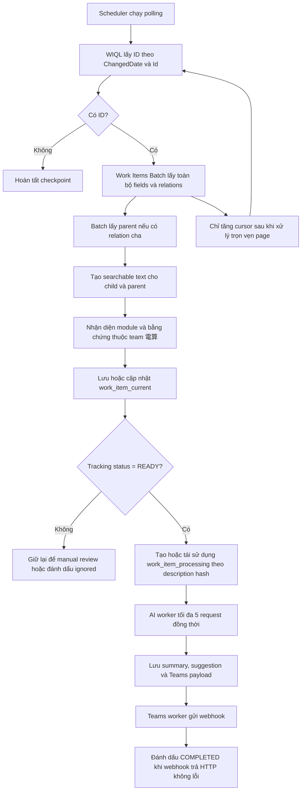
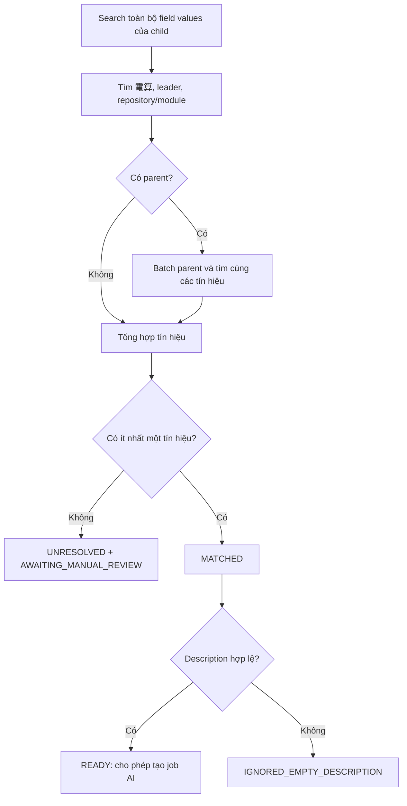
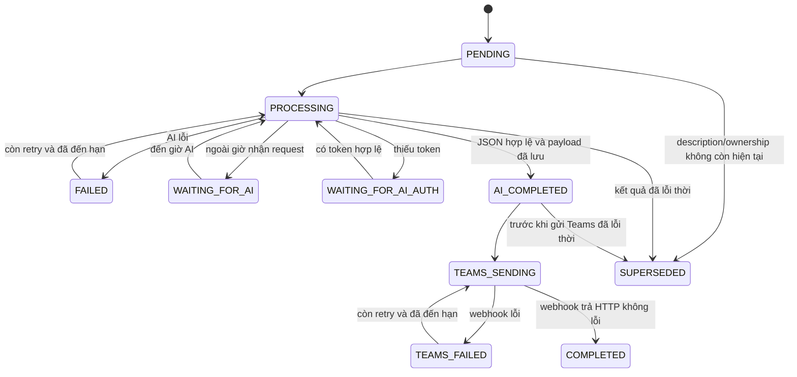
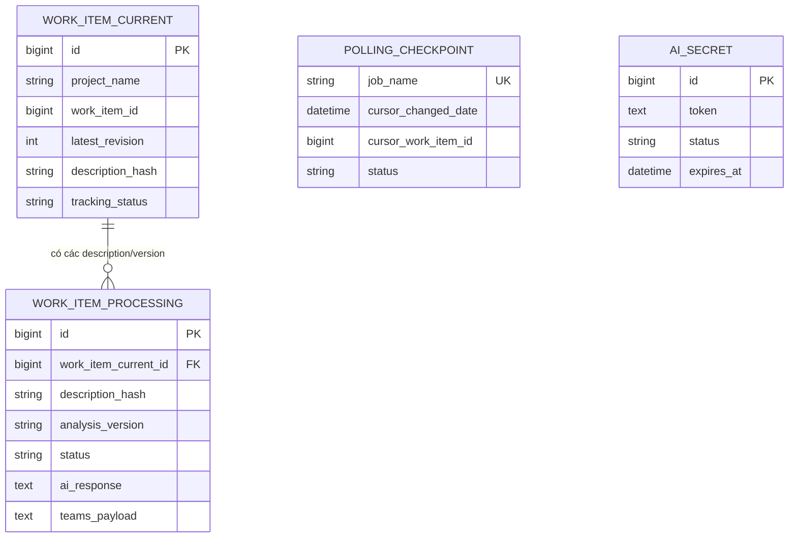

# Nghiệp vụ dự án Work Item Summary

Tài liệu này mô tả đúng hành vi của phiên bản source hiện tại. Source code là nguồn sự thật cuối cùng khi tài liệu và chương trình có khác biệt.

## 1. Mục tiêu

Ứng dụng tự động:

1. Lấy các Azure DevOps Work Item đang ở trạng thái `アクティブ` và có loại `バグ` hoặc `エラー`.
2. Xác định Work Item có thuộc phạm vi sub-team `電算` hay không.
3. Xác định repository và module liên quan.
4. Lưu trạng thái hiện tại và lịch sử xử lý vào MySQL.
5. Chỉ gửi Work Item đã xác định thuộc team và có description hợp lệ sang AI.
6. Yêu cầu AI trả về đúng hai nội dung: tóm tắt và đề xuất đối ứng.
7. Tạo Adaptive Card, tag PIC phù hợp và gửi tới Microsoft Teams Workflow Webhook.
8. Giữ lại Work Item chưa đủ bằng chứng để người dùng kiểm tra thủ công.

Ứng dụng hiện dùng cơ chế polling, không dùng Azure DevOps event hook và không cần Docker.

## 2. Luồng tổng thể



## 3. Chọn Work Item từ Azure DevOps

### 3.1 Điều kiện WIQL

Work Item phải thỏa cả ba điều kiện:

- `System.TeamProject` là project đã cấu hình.
- `System.State = アクティブ`.
- `System.WorkItemType IN (バグ, エラー)`.

Kết quả được sắp xếp tăng dần theo:

1. `System.ChangedDate`
2. `System.Id`

Cursor gồm đúng hai giá trị này. Mỗi page tối đa 200 ID vì Work Items Batch của Azure DevOps giới hạn 200 phần tử.

### 3.2 Không bỏ sót page

Nếu một page trả đủ `batch-size`, ứng dụng tiếp tục WIQL bằng cursor mới. Cursor chỉ được lưu sau khi:

- WIQL trả về danh sách ID;
- Batch trả về đúng và đủ các ID đó;
- mọi Work Item trong page đã được phân tích và lưu DB.

Nếu page lỗi giữa chừng, checkpoint chuyển sang `FAILED` và cursor chưa hoàn tất không được ghi nhận.

Lần đầu chạy với schema mới không có cursor nên ứng dụng duyệt toàn bộ Work Item đang active phù hợp, không chỉ 50 Work Item. Giá trị `WORK_ITEM_PROCESSING_BATCH_SIZE=50` là số job tối đa đọc cho worker, không phải giới hạn số Work Item Azure được lấy.

### 3.3 Field nghiệp vụ

| Thông tin | Azure DevOps field/nguồn |
|---|---|
| ID | `id` hoặc `System.Id` |
| Revision | `rev` hoặc `System.Rev` |
| Type | `System.WorkItemType` |
| State | `System.State` |
| Title | `System.Title` |
| Project | `System.TeamProject` |
| Created at | `System.CreatedDate` |
| Changed at | `System.ChangedDate` |
| Description của `バグ` | Mặc định `Nttdata.TERASOLUNA.Common.Description` |
| Description của `エラー` | Mặc định `Nttdata.TERASOLUNA.Error.Issue` |
| Parent | Relation `System.LinkTypes.Hierarchy-Reverse` |
| URL mở trên UI | Được ứng dụng tạo từ base URL, collection, project và ID |

Hai tên field description có thể thay bằng biến môi trường nếu process template trên server khác.

Batch request không truyền danh sách `fields`, đồng thời dùng `$expand=All`; do đó toàn bộ field values được giữ để tìm bằng chứng. DTO nghiệp vụ chỉ giữ các thông tin cần dùng tiếp.

## 4. Nhận diện sub-team và module

### 4.1 Dữ liệu tìm kiếm

Đối với từng scalar value trong tất cả fields của child và parent, ứng dụng tạo các biến thể:

- nội dung gốc đã chuẩn hóa;
- visible text được trích từ HTML;
- các thuộc tính HTML `href`, `title`, `alt`, `value`.

Chuẩn hóa gồm Unicode NFKC, chữ thường, gộp khoảng trắng, đổi `/` thành `\` và gộp dấu `\` lặp. HTML gốc không bị loại bỏ, vì keyword có thể nằm trong text hoặc attribute.

Tên field không được xem là bằng chứng; chỉ các giá trị field được tìm kiếm.

### 4.2 Các lớp bằng chứng

Child và parent được kiểm tra giống nhau theo ba nhóm:

1. Keyword sub-team: `電算`.
2. Tên hoặc account leader, mặc định gồm:
   - `trinh vu`
   - `trinhvu`
   - `bttrinhvu`
   - `macx\bttrinhvu`
3. Repository hoặc module xuất hiện trong `module-catalog.csv`.

Chỉ cần có ít nhất một bằng chứng ở child hoặc parent thì:

- `sub_team_detection_status = MATCHED`;
- Work Item được xác định thuộc sub-team `電算`.

Nếu không có bằng chứng:

- `sub_team_detection_status = UNRESOLVED`;
- `tracking_status = AWAITING_MANUAL_REVIEW`;
- record vẫn được lưu nhưng không gửi AI và Teams.

`UNRESOLVED` trả lời câu hỏi “đã xác định thuộc team chưa”, còn `AWAITING_MANUAL_REVIEW` trả lời câu hỏi “record này cần được xử lý thế nào”.

### 4.3 Nhận diện repository/module

`module-catalog.csv` là danh sách module thuộc phạm vi team. So khớp không phân biệt hoa thường sau khi chuẩn hóa và dùng biên ký tự để hạn chế match nhầm module ngắn như `a01`, `p01`.

| Trạng thái | Ý nghĩa |
|---|---|
| `MATCHED` | Xác định duy nhất repository và module |
| `REPOSITORY_ONLY` | Xác định repository nhưng chưa xác định duy nhất module |
| `AMBIGUOUS` | Có nhiều repository/module cạnh tranh |
| `UNRESOLVED` | Không tìm thấy bằng chứng trong catalog |

Quy tắc ưu tiên child/parent:

1. Child `MATCHED` luôn được giữ.
2. Nếu child chưa `MATCHED` và parent `MATCHED`, dùng kết quả parent.
3. Nếu child `UNRESOLVED`/`AMBIGUOUS`, có thể dùng kết quả parent tốt hơn.
4. Parent `UNRESOLVED` hoặc `AMBIGUOUS` không ghi đè child.

Module có thể vẫn `REPOSITORY_ONLY` hoặc `AMBIGUOUS` trong khi sub-team đã `MATCHED`; record vẫn đủ điều kiện AI nếu description hợp lệ. Khi không map được PIC chính xác, card sẽ mention tất cả profile đã cấu hình.



## 5. Tracking status của Work Item hiện tại

`work_item_current.tracking_status` có các giá trị:

| Trạng thái | Điều kiện |
|---|---|
| `READY` | Thuộc team, đúng type, active và description không rỗng |
| `AWAITING_MANUAL_REVIEW` | Không tìm được bằng chứng thuộc team |
| `IGNORED_NOT_TARGET` | Type không thuộc `バグ`/`エラー`; là lớp phòng vệ vì WIQL đã lọc |
| `IGNORED_INACTIVE` | State không active; là lớp phòng vệ vì WIQL đã lọc |
| `IGNORED_EMPTY_DESCRIPTION` | Thuộc team nhưng description rỗng |

Ứng dụng không tự động biến manual review thành `READY`. Work Item phải được poll lại để tạo kết quả nhận diện mới. Thay đổi trên Azure làm `ChangedDate` tăng nên item sẽ vào lại WIQL; riêng việc sửa catalog không làm Azure item thay đổi, vì vậy cần chủ động làm item được cập nhật hoặc reset checkpoint theo quy trình vận hành đã kiểm soát.

## 6. Chống trùng và thay đổi revision

### 6.1 Khóa dữ liệu

- `work_item_current`: duy nhất theo `(project_name, work_item_id)`.
- `work_item_processing`: duy nhất theo `(work_item_current_id, description_hash, analysis_version)`.

Fingerprint description là SHA-256 sau khi:

- chuẩn hóa Unicode NFC;
- đổi CRLF/CR thành LF;
- bỏ khoảng trắng ở đầu và cuối toàn description.

Nội dung, hoa thường và HTML bên trong vẫn có ý nghĩa đối với hash.

### 6.2 Quy tắc revision

- Revision tăng nhưng description không đổi: cập nhật current snapshot, không tạo job AI mới.
- Description đổi: cập nhật hash, tạo job mới và đánh dấu các job cũ chưa hoàn tất là `SUPERSEDED`.
- Revision cũ hơn `latest_revision`: bỏ qua để không ghi đè snapshot mới.
- Cùng description nhưng tăng `AI_ANALYSIS_VERSION`: tạo job mới theo version mới.
- Description cũ xuất hiện lại: job tương ứng có thể được kích hoạt lại; nếu đã có AI response và Teams payload thì tiếp tục từ bước Teams, nếu chưa có thì quay lại AI.

`COMPLETED` cũ không bị đổi thành `SUPERSEDED`; nó là lịch sử đã gửi.

## 7. Xử lý AI bất đồng bộ

Chỉ record `READY` và có hash trùng với snapshot hiện tại mới được claim.



Worker AI dùng thread pool và semaphore:

- tối đa `AI_MAX_CONCURRENT_REQUESTS`, mặc định 5, request đồng thời trên một instance ứng dụng;
- không cần chờ đủ một nhóm 5 response; slot nào xong được bổ sung job mới ngay;
- mỗi lần gọi logic tạo một `session_id` mới;
- các HTTP retry và lần refresh sau 401 của cùng lần xử lý giữ nguyên session;
- job retry ở lần sau tạo session mới.

Khung giờ mặc định:

- AI được xem là đang hoạt động: từ `08:00` đến trước `18:30`;
- chỉ khởi tạo request mới: từ `08:00` đến trước `18:25`;
- job ngoài giờ chuyển sang `WAITING_FOR_AI` và được hẹn lại lúc `08:00` ngày kế tiếp.

AI chỉ nhận type, title, repository, module và description. AI phải trả:

```json
{
  "summary": "Tóm tắt ngắn gọn Work Item",
  "suggestion": "Đề xuất kiểm tra hoặc giải pháp đối ứng"
}
```

Hai field phải có nội dung; mỗi field được giới hạn 4.000 ký tự khi lưu. Reasoning/thinking từ stream không được đưa vào Teams.

## 8. Token AI

JWT được lưu trong `ai_secret`; ứng dụng không đọc token từ file.

Một token dùng được khi:

- `status = ACTIVE`;
- có cấu trúc JWT;
- payload có `email` trùng `INTERNAL_AI_USER_EMAIL`;
- payload có `exp` và chưa hết hạn.

Ứng dụng chỉ decode claims cục bộ để chọn token; chữ ký JWT được AI server xác thực khi request thật được gửi.

Mặc định token được refresh khi còn không quá 72 giờ. Refresh thành công cập nhật token và metadata trên chính record. Refresh chủ động thất bại nhưng token cũ còn hạn thì ứng dụng giữ token và thử lại sau 15 phút. Nếu AI trả 401, ứng dụng ép refresh và thử request một lần; nếu token mới vẫn bị 401 thì record bị `REVOKED`.

Khi không còn token dùng được, job ở `WAITING_FOR_AI_AUTH`, không bị mất.

## 9. Microsoft Teams

### 9.1 Mapping PIC

Ba catalog phối hợp như sau:

```text
module-catalog.csv
    repository,module

project_PIC.csv
    repository,module,pic

ms_teams_profile_info.csv
    Pic,DisplayName,Email
```

`Email` phải là User Principal Name/email của account Microsoft Teams cần mention. Đây là ID được đặt vào Adaptive Card mention entity.

Nếu tìm được đúng repository/module, đúng PIC và profile thì chỉ mention account đó. Nếu thiếu module, thiếu assignment hoặc thiếu profile, ứng dụng mention toàn bộ profile trong `ms_teams_profile_info.csv`, tối đa 20 người. Đây không phải mention channel `@Everyone`.

### 9.2 Nội dung card

Card hiển thị:

1. Header nền `accent`, chữ sáng: `#[work_item_id] [work_item_type] [work_item_title]`
2. Project: `[repository] / [module]`
3. PIC: mention account Teams
4. State
5. Created at theo `APP_TIMEZONE`
6. Summary từ AI
7. Suggestion từ AI
8. Nút `Open Work Item`

Payload được tạo và lưu ngay sau khi AI thành công. Teams worker gửi lại chính payload đã lưu, nên retry Teams không gọi AI lần nữa.

`COMPLETED` nghĩa là endpoint webhook trả một HTTP status không thuộc nhóm lỗi. Power Automate/Teams có thể tiếp tục xử lý sau đó, vì vậy message có thể xuất hiện sau khi Java process vừa dừng.

## 10. Vai trò các bảng



| Bảng | Trách nhiệm |
|---|---|
| `work_item_current` | Snapshot mới nhất và kết quả ownership/module của từng Work Item |
| `work_item_processing` | Hàng đợi bền vững và lịch sử xử lý của từng description hash/analysis version |
| `polling_checkpoint` | Cursor và kết quả lần polling |
| `ai_secret` | JWT AI cùng trạng thái refresh/revoke |

Mọi thời điểm được persist theo UTC. Scheduler, log và thời gian hiển thị trong card dùng `APP_TIMEZONE`.

## 11. Lịch chạy mặc định

| Tác vụ | Lịch |
|---|---|
| Poll Work Item | Mỗi 5 phút trong các giờ `08` đến `18` |
| Morning recovery | `08:00` hằng ngày |
| Dispatcher AI | Kiểm tra mỗi 1 giây |
| Dispatcher Teams | Kiểm tra mỗi 1 giây |
| Token maintenance | Sau 30 giây từ lúc start, sau đó mỗi 1 giờ |
| Stale job recovery | Kiểm tra tối đa mỗi 60 giây, reset job treo quá 30 phút |

Ứng dụng không tự poll ngay khi start, trừ khi thời điểm start trùng lịch cron. Tuy vậy các processing job đã có trong DB và đến hạn sẽ được dispatcher tiếp tục gần như ngay lập tức.

## 12. Giới hạn vận hành hiện tại

- Thiết kế vận hành chính là một app instance. Nếu chạy nhiều instance, giới hạn 5 AI request áp dụng cho mỗi instance và `synchronized` của polling không phải distributed lock.
- `TEAMS_SEND_FALLBACK_ON_AI_FAILURE` đã có property nhưng chưa tham gia luồng hiện tại; AI thất bại không gửi fallback card.
- Không có REST endpoint để chạy poll thủ công.
- Teams dispatcher gửi tuần tự một batch; khi shutdown, request webhook đang diễn ra có thể đã được Power Automate chấp nhận.
- Actuator không dùng `INTERNAL_API_KEY`; phải giới hạn truy cập ở firewall/network nếu chạy ngoài máy cá nhân.
